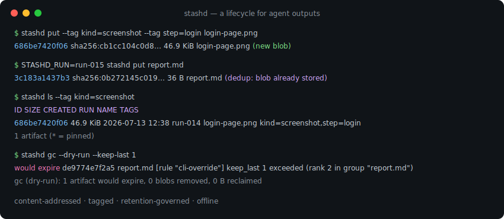
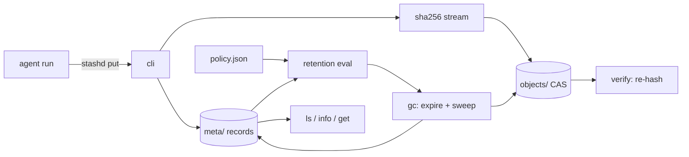

# stashd

[English](README.md) | [中文](README.zh.md) | [日本語](README.ja.md)

[](LICENSE) [](go.mod) [](CHANGELOG.md)  [](CONTRIBUTING.md)

**stashd：エージェント出力のためのオープンソース・依存ゼロのアーティファクトストア — 内容アドレスと重複排除、実行来歴のタグ付け、そして削除する全バイトに理由を示す保持ポリシーによる統治。**



```bash
git clone https://github.com/JaydenCJ/stashd && cd stashd
go build -o stashd ./cmd/stashd    # single static binary, stdlib only
```

> プレリリース：v0.1.0 はまだパッケージレジストリに公開されていません。上記のとおりソースからビルドしてください（Go ≥1.22 なら可）。

## なぜ stashd？

エージェントの実行は出力を撒き散らします：ステップごとのスクリーンショット、試行ごとの diff、リトライごとのレポートが、誰も消す勇気がなく誰も検索できない `/tmp` や `runs/` ディレクトリに流れ込みます。6 週間後にディスクは満杯になり、本当に重要な問い — *このスクリーンショットはどの実行が生んだのか、改変されていないと信じられるか？* — には答えられません。既存の選択肢は的を外しています：cron の `find -mtime` 掃除は年齢しか知らず来歴を知らず、唯一必要だったレポートまで消します。MinIO/S3 のようなオブジェクトストレージが管理するのはバケットでありライフサイクルではありません — 実行をまたぐ重複排除はなく、保持はプレフィックス単位、しかもサーバの世話が要ります。CI のアーティファクトストアは実行を知っていますが、他人のクラウドで他人の期限に従って生きています。stashd は意図的にオブジェクトストレージでもファイルサーバでもありません：やるのは*ライフサイクル管理*です。各アーティファクトは SHA-256 で一度だけ保存され（リトライの同一出力のバイト代は一度きり）、実行 ID とタグが刻印され、自分で書いたルール — タグ別の最長保持、グループ別 keep-last-N、ストア全体のバイト予算 — で失効します。dry-run モード付きで、削除のたびに理由が引用されます。

| | stashd | `/tmp` + cron find | MinIO / S3 | CI アーティファクトストア |
|---|---|---|---|---|
| 実行をまたぐ内容重複排除 | ✅ SHA-256 CAS | ❌ | ❌ オブジェクト単位 | ❌ |
| タグ / 実行 / 年齢 / 件数 / バイトでの保持 | ✅ | 年齢のみ | プレフィックス/タグ規則、年齢のみ | 固定期限 |
| 全アーティファクトに実行来歴 | ✅ | ❌ | メタデータは自作 | ✅ 自社 CI 内のみ |
| すべての削除を説明（dry-run + 理由） | ✅ | ❌ | ❌ | ❌ |
| 完全性検査（読み出し時の再ハッシュ + `verify`） | ✅ | ❌ | ✅ | ❌ |
| オフライン・ローカル・単一バイナリ | ✅ | ✅ | ❌ サーバ必須 | ❌ SaaS |
| ランタイム依存 | 0 | 0（OS 標準） | サーバ + SDK | 該当なし |

<sub>2026-07-13 時点で確認：stashd の import は Go 標準ライブラリのみ。MinIO の Go SDK だけで 15+ モジュールを取り込みます（サーバ運用は別勘定）。</sub>

## 特徴

- **内容アドレスと重複排除のストレージ** — blob は自身の SHA-256 名で原子的に書かれ読み取り専用；5 回のリトライが保存した同じレポートのバイト代は一度きりで、`stats` が節約分を示します。
- **ファイルだけでなくライフサイクルのメタデータ** — 各アーティファクトは実行 ID（`--run` か `$STASHD_RUN`）、`key=value` タグ、メディアタイプ、pin ビットを持ち、`ls` はそのすべてで glob 付きフィルタできます。
- **レビュー可能なデータとしての保持** — `policy.json` に先勝ちルールを列挙：タグ/名前/実行にマッチする `max_age`、名前または実行でグループ化する `keep_last` N、さらに重複 blob を一度だけ数えるストア全体の `max_total_bytes` 予算。
- **仕事を見せる GC** — `gc --dry-run` は正確な計画を印字；各失効はルールと理由を引用（`max_age 72h exceeded (age 4.2d)`）；pin 済みはバイト予算を含む全ルールから不可侵です。
- **証明できる完全性** — `get` はストリームしながら再ハッシュし、静かなビット腐敗を大きなエラーに変えます；`verify` は全 blob を再ハッシュし全参照を突合、何か見つかれば終了コード 1。
- **スクリプトのための設計** — 12 桁 ID は docker 流の一意プレフィックス解決（digest プレフィックスも可）、読み取り系コマンド全部に `--json`、終了コードは地味に：0 正常、1 完全性/gc 違反、2 用法、3 実行時。
- **依存ゼロ・完全オフライン** — Go 標準ライブラリのみ。サーバなし、デーモンなし、テレメトリなし、通信は永遠になし。

## クイックスタート

```bash
export STASHD_RUN=run-014          # everything this agent run stores is stamped
stashd put --tag kind=screenshot --tag step=login login-page.png
stashd put --tag kind=diff changes.diff
stashd put report.md
STASHD_RUN=run-015 stashd put report.md   # identical retry output → dedup
stashd ls
```

実際にキャプチャした出力：

```text
686be7420f06  sha256:cb1cc104c0d8…  46.9 KiB  login-page.png  (new blob)
e5f942790e0b  sha256:87089ae16e6c…  66 B  changes.diff  (new blob)
de9774e7f2a5  sha256:0b272145c019…  36 B  report.md  (new blob)
3c183a1437b3  sha256:0b272145c019…  36 B  report.md  (dedup: blob already stored)
ID            SIZE      CREATED           RUN      NAME            TAGS
3c183a1437b3  36 B      2026-07-13 12:38  run-015  report.md       -
de9774e7f2a5  36 B      2026-07-13 12:38  run-014  report.md       -
e5f942790e0b  66 B      2026-07-13 12:38  run-014  changes.diff    kind=diff
686be7420f06  46.9 KiB  2026-07-13 12:38  run-014  login-page.png  kind=screenshot,step=login
4 artifacts (* = pinned)
```

保持ポリシーをインストールし、gc が何をするか下見します（実際の出力）：

```text
$ stashd policy set examples/retention-policy.json
policy installed: 2 rules, budget 2GiB
$ stashd gc --dry-run --keep-last 1
would expire de9774e7f2a5  report.md  [rule "cli-override"] keep_last 1 exceeded (rank 2 in group "report.md")
gc (dry-run): 1 artifact would expire, 0 blobs removed, 0 B reclaimed
```

## 保持ポリシー

`stashd policy set <file.json>` は検証済みポリシーをインストールします。未知フィールドは拒否されるため、タイポが保持を静かに無効化することはありません。ルールは先勝ち；pin 済みは常に免除。schema 全体と gc の意味論は [docs/store-layout.md](docs/store-layout.md) に。

| キー | 既定 | 効果 |
|---|---|---|
| `rules[].match.tags` | 全マッチ | これらの `key=value` タグを要求（すべて必須） |
| `rules[].match.name` | 全マッチ | アーティファクト名への glob（`*`、`?`） |
| `rules[].match.run` | 全マッチ | 実行 ID への glob |
| `rules[].max_age` | — | この期間より厳密に古いものを失効（`72h`、`7d`、`2w`） |
| `rules[].keep_last` | — | グループごとに最新 N 件のみ保持 |
| `rules[].group_by` | `name` | `keep_last` のグループ化キー：`name` か `run` |
| `max_total_bytes` | — | ストア全体の物理予算（`2GiB`）；最古の未 pin から退避、重複排除を認識 |

## CLI リファレンス

`stashd <command> [flags] [args]` — 全コマンドが `--store PATH` を受け付けます（既定 `$STASHD_DIR`、なければ `~/.stashd`）。

| コマンド | 効果 |
|---|---|
| `put [--name] [--type] [--run] [--tag k=v]… [--pin] [-q\|--json] <file\|->` | 内容を保存し、アーティファクト ID を印字 |
| `get [-o FILE] <ref>` | 再ハッシュしながら内容をストリーム出力 |
| `info [--json] <ref>` / `ls [--tag]… [--run] [--name] [--pinned] [--json]` | 検査と照会 |
| `tag <ref> k=v…` / `untag <ref> k…` / `pin <ref>` / `unpin <ref>` | ライフサイクルのメタデータを編集 |
| `rm [--force] <ref>` | レコードを削除；blob は無参照時のみ解放 |
| `gc [--dry-run] [--max-age] [--keep-last] [--max-bytes] [--json]` | ポリシー（または臨時上書き）を適用して掃除 |
| `policy [show \| set <file>]` / `stats` / `verify` / `version` | ストアを管理・計測・証明 |

## 検証

このリポジトリは CI を同梱しません。上記の主張はすべてローカル実行で検証されます：

```bash
go test ./...            # 91 deterministic tests, offline, < 3 s
bash scripts/smoke.sh    # end-to-end CLI lifecycle check, prints SMOKE OK
```

## アーキテクチャ



## ロードマップ

- [x] v0.1.0 — 重複排除付き SHA-256 CAS、タグ/実行/pin、先勝ち保持ルール（max_age・keep_last・バイト予算）、dry-run 付きで説明可能な gc、検証付き読み出し、`verify`/`stats`、91 テスト + smoke スクリプト
- [ ] `stashd export --run <id>` / `import` バンドル：一実行分の証拠を 1 ファイルで持ち運ぶ
- [ ] `stashd serve` — 127.0.0.1 にバインドする読み取り専用アーティファクトブラウザ
- [ ] コールド blob 向けの任意 zstd 圧縮
- [ ] `stashd adopt <dir>`：既存の `/tmp` アーティファクトの山をタグ推定つきで一括取り込み
- [ ] 実行ごとのマニフェスト：一実行の全生成物を列挙する署名ハッシュ一覧

全リストは [open issues](https://github.com/JaydenCJ/stashd/issues) を参照。

## コントリビュート

Issue・ディスカッション・PR を歓迎します — ローカルのワークフロー（フォーマット、vet、テスト、`SMOKE OK`）は [CONTRIBUTING.md](CONTRIBUTING.md) へ。入門向けは [good first issue](https://github.com/JaydenCJ/stashd/issues?q=is%3Aissue+is%3Aopen+label%3A%22good+first+issue%22) のラベル付き、設計の議論は [Discussions](https://github.com/JaydenCJ/stashd/discussions) で。

## ライセンス

[MIT](LICENSE)
