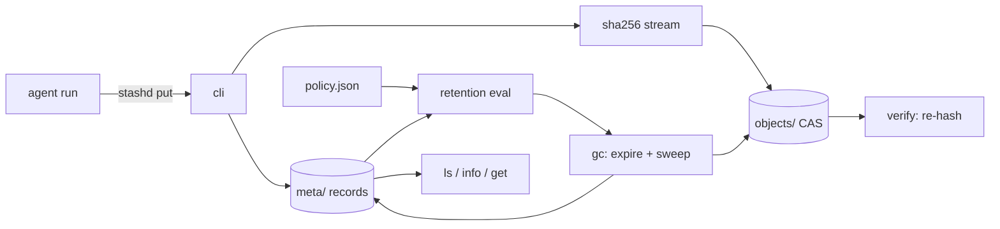

# stashd

[English](README.md) | [中文](README.zh.md) | [日本語](README.ja.md)

[](LICENSE) [](go.mod) [](CHANGELOG.md)  [](CONTRIBUTING.md)

**stashd：an open-source, zero-dependency artifact store for agent outputs — content-addressed with dedup, tagged with run provenance, and governed by retention policies that explain every byte they delete.**


```bash
git clone https://github.com/JaydenCJ/stashd && cd stashd
go build -o stashd ./cmd/stashd    # single static binary, stdlib only
```

> Pre-release: v0.1.0 is not tagged on a package registry yet; build from source as above (any Go ≥1.22).

## Why stashd?

Agent runs spew outputs: screenshots per step, diffs per attempt, reports per retry, all dumped into `/tmp` or a `runs/` directory that nobody dares to delete and nobody can search. Six weeks later the disk is full, and the one question that matters — *which run produced this screenshot, and can I trust it hasn't changed?* — is unanswerable. The existing options miss the point: a cron `find -mtime` sweep knows ages but not provenance, and deletes the one report you needed; object stores like MinIO/S3 manage buckets, not lifecycles — no dedup across runs, retention only by prefix, and a server to babysit; CI artifact stores know runs but live in someone else's cloud with someone else's expiry. stashd is deliberately not object storage or a file server: it is *lifecycle management*. Every artifact is stored once by SHA-256 (identical retry outputs cost bytes once), stamped with run ID and tags, and expired by rules you wrote — per-tag max-age, keep-last-N per group, a store-wide byte budget — with a dry-run mode and a quoted reason for every deletion.

| | stashd | `/tmp` + cron find | MinIO / S3 | CI artifact stores |
|---|---|---|---|---|
| Content dedup across runs | ✅ SHA-256 CAS | ❌ | ❌ per-object | ❌ |
| Retention by tag / run / age / count / bytes | ✅ | age only | prefix/tag rules, age only | fixed expiry |
| Run provenance on every artifact | ✅ | ❌ | DIY metadata | ✅ own CI only |
| Explains every deletion (dry-run + reasons) | ✅ | ❌ | ❌ | ❌ |
| Integrity check (re-hash on read + `verify`) | ✅ | ❌ | ✅ | ❌ |
| Offline, local, single binary | ✅ | ✅ | ❌ server | ❌ SaaS |
| Runtime dependencies | 0 | 0 (built-in) | server + SDK | n/a |

<sub>Checked 2026-07-13: stashd imports the Go standard library only; MinIO's Go SDK alone pulls 15+ modules, before running the server.</sub>

## Features

- **Content-addressed, deduplicated storage** — blobs live under their SHA-256, written atomically and read-only; the same report stored by five retries costs its bytes exactly once, and `stats` shows the win.
- **Lifecycle metadata, not just files** — every artifact carries a run ID (`--run` or `$STASHD_RUN`), `key=value` tags, a media type, and a pin bit; `ls` filters by all of them, with globs.
- **Retention as reviewable data** — a `policy.json` of first-match-wins rules: `max_age` per tag/name/run match, `keep_last` N per name or run group, plus a store-wide `max_total_bytes` budget that counts deduped blobs once.
- **GC that shows its work** — `gc --dry-run` prints the exact plan; every expiry quotes its rule and reason (`max_age 72h exceeded (age 4.2d)`); pinned artifacts are untouchable by every rule including the byte budget.
- **Integrity you can prove** — `get` re-hashes content as it streams, so silent bit-rot becomes a loud error; `verify` re-hashes every blob and cross-checks every reference, exit code 1 on any finding.
- **Script-friendly by design** — 12-char IDs with docker-style unique-prefix resolution (digest prefixes work too), `--json` on every reading command, and boring exit codes: 0 ok, 1 integrity/gc breach, 2 usage, 3 runtime.
- **Zero dependencies, fully offline** — Go standard library only; no server, no daemon, no telemetry, no network, ever.

## Quickstart

```bash
export STASHD_RUN=run-014          # everything this agent run stores is stamped
stashd put --tag kind=screenshot --tag step=login login-page.png
stashd put --tag kind=diff changes.diff
stashd put report.md
STASHD_RUN=run-015 stashd put report.md   # identical retry output → dedup
stashd ls
```

Real captured output:

```text
686be7420f06  sha256:cb1cc104c0d8…  46.9 KiB  login-page.png  (new blob)
e5f942790e0b  sha256:87089ae16e6c…  66 B  changes.diff  (new blob)
de9774e7f2a5  sha256:0b272145c019…  36 B  report.md  (new blob)
3c183a1437b3  sha256:0b272145c019…  36 B  report.md  (dedup: blob already stored)
ID            SIZE      CREATED           RUN      NAME            TAGS
3c183a1437b3  36 B      2026-07-13 12:38  run-015  report.md       -
de9774e7f2a5  36 B      2026-07-13 12:38  run-014  report.md       -
e5f942790e0b  66 B      2026-07-13 12:38  run-014  changes.diff    kind=diff
686be7420f06  46.9 KiB  2026-07-13 12:38  run-014  login-page.png  kind=screenshot,step=login
4 artifacts (* = pinned)
```

Install a retention policy, then preview what gc would do (real output):

```text
$ stashd policy set examples/retention-policy.json
policy installed: 2 rules, budget 2GiB
$ stashd gc --dry-run --keep-last 1
would expire de9774e7f2a5  report.md  [rule "cli-override"] keep_last 1 exceeded (rank 2 in group "report.md")
gc (dry-run): 1 artifact would expire, 0 blobs removed, 0 B reclaimed
```

## Retention policy

`stashd policy set <file.json>` installs a validated policy; unknown fields are rejected so a typo can never silently disable retention. Rules are first-match-wins; pinned artifacts are always exempt. Full schema and gc semantics in [docs/store-layout.md](docs/store-layout.md).

| Key | Default | Effect |
|---|---|---|
| `rules[].match.tags` | match all | require these `key=value` tags (conjunctive) |
| `rules[].match.name` | match all | glob over artifact names (`*`, `?`) |
| `rules[].match.run` | match all | glob over run IDs |
| `rules[].max_age` | — | expire artifacts strictly older than this (`72h`, `7d`, `2w`) |
| `rules[].keep_last` | — | keep only the newest N per group |
| `rules[].group_by` | `name` | `keep_last` grouping key: `name` or `run` |
| `max_total_bytes` | — | store-wide physical budget (`2GiB`); evicts oldest unpinned first, dedup-aware |

## CLI reference

`stashd <command> [flags] [args]` — every command accepts `--store PATH` (default `$STASHD_DIR`, else `~/.stashd`).

| Command | Effect |
|---|---|
| `put [--name] [--type] [--run] [--tag k=v]… [--pin] [-q\|--json] <file\|->` | store content, print the artifact ID |
| `get [-o FILE] <ref>` | stream content out, re-hashing as it goes |
| `info [--json] <ref>` / `ls [--tag]… [--run] [--name] [--pinned] [--json]` | inspect and query |
| `tag <ref> k=v…` / `untag <ref> k…` / `pin <ref>` / `unpin <ref>` | edit lifecycle metadata |
| `rm [--force] <ref>` | drop a record; the blob is freed only when unreferenced |
| `gc [--dry-run] [--max-age] [--keep-last] [--max-bytes] [--json]` | apply policy (or ad-hoc overrides) and sweep |
| `policy [show \| set <file>]` / `stats` / `verify` / `version` | manage, measure, and prove the store |

## Verification

This repository ships no CI; every claim above is verified by local runs:

```bash
go test ./...            # 91 deterministic tests, offline, < 3 s
bash scripts/smoke.sh    # end-to-end CLI lifecycle check, prints SMOKE OK
```

## Architecture



## Roadmap

- [x] v0.1.0 — SHA-256 CAS with dedup, tags/runs/pins, first-match retention rules (max_age, keep_last, byte budget), explainable gc with dry-run, verifying reads, `verify`/`stats`, 91 tests + smoke script
- [ ] `stashd export --run <id>` / `import` bundles, so a run's evidence can travel as one file
- [ ] `stashd serve` — read-only artifact browser bound to 127.0.0.1
- [ ] Optional zstd compression for cold blobs
- [ ] `stashd adopt <dir>` to bulk-ingest an existing `/tmp` artifact pile with inferred tags
- [ ] Per-run manifests: one signed-hash listing of everything a run produced

See the [open issues](https://github.com/JaydenCJ/stashd/issues) for the full list.

## Contributing

Issues, discussions and pull requests are welcome — see [CONTRIBUTING.md](CONTRIBUTING.md) for the local workflow (format, vet, tests, `SMOKE OK`). Good entry points are labelled [good first issue](https://github.com/JaydenCJ/stashd/issues?q=is%3Aissue+is%3Aopen+label%3A%22good+first+issue%22), and design questions live in [Discussions](https://github.com/JaydenCJ/stashd/discussions).

## License

[MIT](LICENSE)
