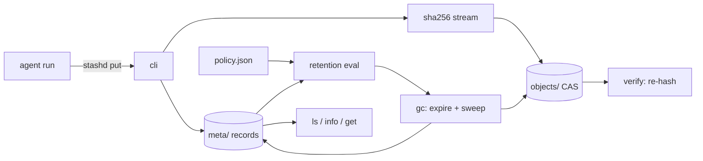

# stashd

[English](README.md) | [中文](README.zh.md) | [日本語](README.ja.md)

[](LICENSE) [](go.mod) [](CHANGELOG.md)  [](CONTRIBUTING.md)

**stashd：一个开源、零依赖的 agent 输出制品仓库 —— 内容寻址加去重、带运行溯源标签，并由保留策略治理，删除的每一个字节都有解释。**


```bash
git clone https://github.com/JaydenCJ/stashd && cd stashd
go build -o stashd ./cmd/stashd    # single static binary, stdlib only
```

> 预发布提示：v0.1.0 尚未发布到任何包仓库；请按上述方式从源码构建（Go ≥1.22 均可）。

## 为什么选 stashd？

Agent 运行会喷出大量输出：每一步的截图、每次尝试的 diff、每次重试的报告，全部倒进 `/tmp` 或某个没人敢删、也没人搜得动的 `runs/` 目录。六周之后磁盘满了，而真正要紧的那个问题——*这张截图是哪次运行产生的？我能确信它没被改过吗？*——却无从回答。现有方案都没答到点子上：cron 的 `find -mtime` 清扫只认年龄不认出处，还会删掉你唯一需要的那份报告；MinIO/S3 这类对象存储管理的是桶，不是生命周期——跨运行不去重、只能按前缀设保留，还得伺候一台服务器；CI 制品仓库懂运行，却活在别人的云上、按别人的过期规则。stashd 刻意不做对象存储、也不做文件服务器：它做的是*生命周期管理*。每个制品按 SHA-256 只存一份（重试产生的相同输出只花一次字节），盖上运行 ID 和标签，并按你自己写的规则过期——按标签的最长保留期、按分组的 keep-last-N、全库字节预算——带 dry-run 预演模式，每一次删除都引用其理由。

| | stashd | `/tmp` + cron find | MinIO / S3 | CI 制品仓库 |
|---|---|---|---|---|
| 跨运行内容去重 | ✅ SHA-256 CAS | ❌ | ❌ 按对象 | ❌ |
| 按标签 / 运行 / 年龄 / 数量 / 字节保留 | ✅ | 仅按年龄 | 前缀/标签规则，仅按年龄 | 固定过期 |
| 每个制品带运行溯源 | ✅ | ❌ | 自己拼元数据 | ✅ 仅限自家 CI |
| 解释每次删除（dry-run + 理由） | ✅ | ❌ | ❌ | ❌ |
| 完整性校验（读取时重哈希 + `verify`） | ✅ | ❌ | ✅ | ❌ |
| 离线、本地、单二进制 | ✅ | ✅ | ❌ 需服务器 | ❌ SaaS |
| 运行时依赖 | 0 | 0（系统自带） | 服务器 + SDK | 不适用 |

<sub>核对于 2026-07-13：stashd 只 import Go 标准库；仅 MinIO 的 Go SDK 就拉取 15+ 个模块，还没算跑服务器本身。</sub>

## 特性

- **内容寻址、自动去重的存储** —— blob 以自身 SHA-256 命名，原子写入且只读；五次重试存的同一份报告只花一次字节，`stats` 直接展示省了多少。
- **不止是文件，还有生命周期元数据** —— 每个制品都带运行 ID（`--run` 或 `$STASHD_RUN`）、`key=value` 标签、媒体类型和 pin 位；`ls` 可按所有这些过滤，支持 glob。
- **保留策略即可审阅的数据** —— 一份 `policy.json`、首条命中生效的规则集：按标签/名称/运行匹配的 `max_age`、按名称或运行分组的 `keep_last` N，外加全库 `max_total_bytes` 预算，去重的 blob 只计一次。
- **把工作摆在明面上的 GC** —— `gc --dry-run` 打印完整计划；每次过期都引用规则和理由（`max_age 72h exceeded (age 4.2d)`）；被 pin 的制品对所有规则免疫，包括字节预算。
- **可证明的完整性** —— `get` 边流式输出边重哈希，静默位腐烂变成响亮的报错；`verify` 重哈希每个 blob 并交叉核对每条引用，任何发现都以退出码 1 报告。
- **为脚本而生** —— 12 位 ID 支持 docker 式唯一前缀解析（digest 前缀同样可用），所有读取命令都有 `--json`，退出码朴实无华：0 正常、1 完整性/gc 违规、2 用法错误、3 运行时错误。
- **零依赖、完全离线** —— 只用 Go 标准库；没有服务器、没有守护进程、没有遥测、永不联网。

## 快速上手

```bash
export STASHD_RUN=run-014          # everything this agent run stores is stamped
stashd put --tag kind=screenshot --tag step=login login-page.png
stashd put --tag kind=diff changes.diff
stashd put report.md
STASHD_RUN=run-015 stashd put report.md   # identical retry output → dedup
stashd ls
```

真实捕获的输出：

```text
686be7420f06  sha256:cb1cc104c0d8…  46.9 KiB  login-page.png  (new blob)
e5f942790e0b  sha256:87089ae16e6c…  66 B  changes.diff  (new blob)
de9774e7f2a5  sha256:0b272145c019…  36 B  report.md  (new blob)
3c183a1437b3  sha256:0b272145c019…  36 B  report.md  (dedup: blob already stored)
ID            SIZE      CREATED           RUN      NAME            TAGS
3c183a1437b3  36 B      2026-07-13 12:38  run-015  report.md       -
de9774e7f2a5  36 B      2026-07-13 12:38  run-014  report.md       -
e5f942790e0b  66 B      2026-07-13 12:38  run-014  changes.diff    kind=diff
686be7420f06  46.9 KiB  2026-07-13 12:38  run-014  login-page.png  kind=screenshot,step=login
4 artifacts (* = pinned)
```

安装一份保留策略，再预演 gc 会做什么（真实输出）：

```text
$ stashd policy set examples/retention-policy.json
policy installed: 2 rules, budget 2GiB
$ stashd gc --dry-run --keep-last 1
would expire de9774e7f2a5  report.md  [rule "cli-override"] keep_last 1 exceeded (rank 2 in group "report.md")
gc (dry-run): 1 artifact would expire, 0 blobs removed, 0 B reclaimed
```

## 保留策略

`stashd policy set <file.json>` 安装一份经过校验的策略；未知字段一律拒绝，写错字永远不会悄悄让保留失效。规则首条命中生效；被 pin 的制品始终豁免。完整 schema 与 gc 语义见 [docs/store-layout.md](docs/store-layout.md)。

| 键 | 默认 | 效果 |
|---|---|---|
| `rules[].match.tags` | 匹配全部 | 要求带有这些 `key=value` 标签（须全部满足） |
| `rules[].match.name` | 匹配全部 | 对制品名称的 glob（`*`、`?`） |
| `rules[].match.run` | 匹配全部 | 对运行 ID 的 glob |
| `rules[].max_age` | — | 过期严格早于该时长的制品（`72h`、`7d`、`2w`） |
| `rules[].keep_last` | — | 每组只保留最新的 N 个 |
| `rules[].group_by` | `name` | `keep_last` 的分组键：`name` 或 `run` |
| `max_total_bytes` | — | 全库物理预算（`2GiB`）；优先驱逐最旧的未 pin 制品，且感知去重 |

## CLI 参考

`stashd <command> [flags] [args]` —— 每个命令都接受 `--store PATH`（默认 `$STASHD_DIR`，否则 `~/.stashd`）。

| 命令 | 效果 |
|---|---|
| `put [--name] [--type] [--run] [--tag k=v]… [--pin] [-q\|--json] <file\|->` | 存入内容，打印制品 ID |
| `get [-o FILE] <ref>` | 流式取出内容，边取边重哈希 |
| `info [--json] <ref>` / `ls [--tag]… [--run] [--name] [--pinned] [--json]` | 检视与查询 |
| `tag <ref> k=v…` / `untag <ref> k…` / `pin <ref>` / `unpin <ref>` | 编辑生命周期元数据 |
| `rm [--force] <ref>` | 删除记录；blob 只在无引用时才释放 |
| `gc [--dry-run] [--max-age] [--keep-last] [--max-bytes] [--json]` | 应用策略（或临时覆盖）并清扫 |
| `policy [show \| set <file>]` / `stats` / `verify` / `version` | 管理、度量、证明这个仓库 |

## 验证

本仓库不带 CI；上面的每一条主张都由本地运行验证：

```bash
go test ./...            # 91 deterministic tests, offline, < 3 s
bash scripts/smoke.sh    # end-to-end CLI lifecycle check, prints SMOKE OK
```

## 架构



## 路线图

- [x] v0.1.0 —— SHA-256 CAS 加去重、标签/运行/pin、首条命中的保留规则（max_age、keep_last、字节预算）、可解释且带 dry-run 的 gc、校验式读取、`verify`/`stats`、91 个测试 + smoke 脚本
- [ ] `stashd export --run <id>` / `import` 打包，让一次运行的证据能装进一个文件带走
- [ ] `stashd serve` —— 绑定 127.0.0.1 的只读制品浏览器
- [ ] 冷 blob 的可选 zstd 压缩
- [ ] `stashd adopt <dir>`：批量收编既有的 `/tmp` 制品堆并推断标签
- [ ] 逐运行清单：一次运行全部产出的签名哈希列表

完整列表见 [open issues](https://github.com/JaydenCJ/stashd/issues)。

## 参与贡献

欢迎 issue、讨论和 PR —— 本地工作流（格式化、vet、测试、`SMOKE OK`）见 [CONTRIBUTING.md](CONTRIBUTING.md)。入门任务标注了 [good first issue](https://github.com/JaydenCJ/stashd/issues?q=is%3Aissue+is%3Aopen+label%3A%22good+first+issue%22)，设计问题请到 [Discussions](https://github.com/JaydenCJ/stashd/discussions)。

## 许可证

[MIT](LICENSE)
